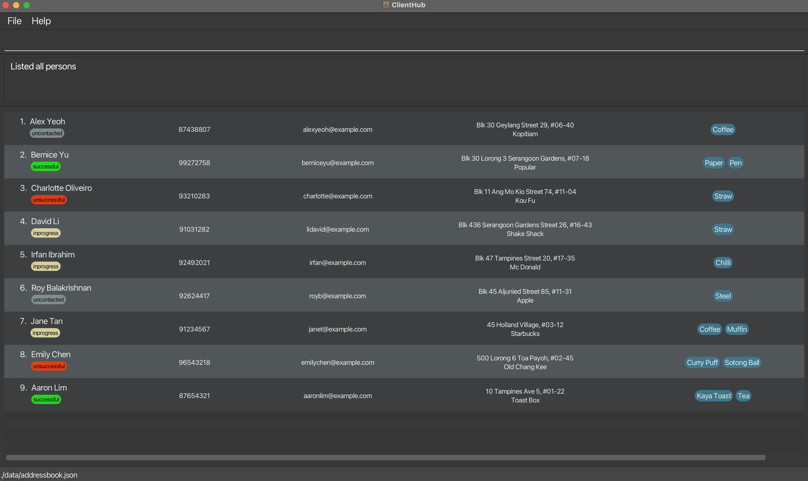
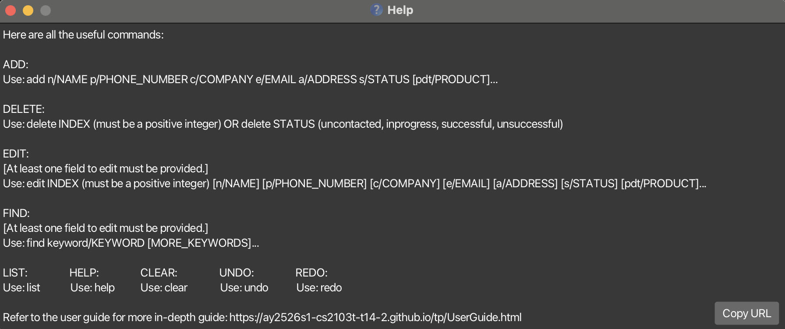
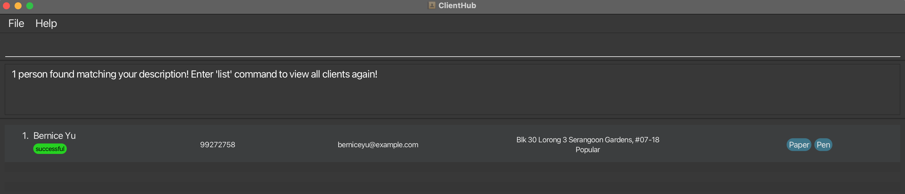

# ClientHub User Guide

## Introduction

Welcome to ClientHub! This is a **Command Line Interface (CLI)** based _contact management application_
designed specifically for sales representatives based in Singapore who handle B2B (Business-to-Business) sales.

> ClientHub provides a **fast, lightweight, and efficient way to manage client information, search and filter contacts,
> and track client statuses**.

 
 

## Table of Contents
- [Navigate the guide](#navigate-the-guide)
- [Quick Start](#quick-start)
  - [Installation](#installation)
- [Features](#features)
  - [Important points](#important-points)
  - [View help `help`](#view-help-help)
  - [Clear all entries `clear`](#clear-all-entries-clear)
  - [Add a client `add`](#add-a-client-add)
  - [List all clients `list`](#list-all-clients-list)
  - [Edit information `edit`](#edit-information-edit)
  - [Find a client `find`](#find-a-client-find)
  - [Delete a client `delete`](#delete-a-client-delete)
  - [Undo previous command `undo`](#undo-previous-command-undo)
  - [Redo previously undone command: `redo`](#redo-previously-undone-command-redo)
  - [Exit the program `exit`](#exit-the-program-exit)
  - [Save the data](#save-the-data)
  - [Edit the data file](#edit-the-data-file)
- [FAQ](#faq)
- [Legends](#legends)
- [Known Issues](#known-issues)
- [Command Summary](#command-summary)

---

 
 

## Navigate the guide

If you are **_new to ClientHub_**

- Continue with the installation guide [below](#installation)

If you have **_already installed ClientHub_**

- Head to the [command summary](#command-summary) section for a quick overview of all commands and their usage
- Read the [features](#features) section for more details on each command
- Browse the [FAQ](#faq) for quick answers

 
 

## Quick Start

This guide will walk you through the **installation of ClientHub**, and **how to use it**.

 
 

### Installation

1. Ensure you have **Java 17** installed.
   <box type="info" seamless>
   Please refer to this <a href="https://se-education.org/guides/tutorials/javaInstallation.html">guide</a> for Java installation.
   </box>

   <box type="info" seamless>
   What's this box? Check out <a href="#legends">legends</a> to find out!
   </box>
   
2. Download the latest `ClientHub.jar` file from [here](https://github.com/AY2526S1-CS2103T-T14-2/tp/releases)

3. Copy the file to the folder you want to use as the home folder.

4. Open a command terminal and `cd` into the folder from Step 3.

<box type="tip" seamless>
Unsure how to navigate in the terminal?

If the `ClientHub.jar` file is in the folder `Desktop/ClientHub`:

- Type `cd Desktop/ClientHub` into the terminal
- You are on the right track if you see the following:
  `C:\Users\YOUR_NAME\Desktop\ClientHub` on Windows or
  `user@XXX ClientHub` on Mac
  </box>

5. Use `java -jar Clienthub.jar` command to run the application.

> After running the application, you should see this
> 

6. Type the command in the command box and press Enter to execute it. e.g. typing **`help`** and pressing Enter will open the help window. 
   Some example commands you can try:

   - `list` : Lists all clients.

   - `add n/John Doe p/98765432 c/apple e/johnd@example.com a/John street, block 123, #01-01 s/uncontacted` : Adds a contact named `John Doe` to ClientHub.

   - `delete 3` : Deletes the 3rd client shown in the current list.

   - `clear` : Deletes all clients.

   - `exit` : Exits the app.

7. Refer to the [Features](#features) below for details of each command.

---

 
 

## Features

Before diving into the features, do take note of some [important points](#important-points).

 

---

#### Important points
**Notes about the command format:** 

- Words in `UPPER_CASE` are the parameters that you need to provide. 
  e.g. in `add n/NAME`, `NAME` can be replaced by `John Doe`.

- Items in square brackets are **optional**. 
  e.g `n/NAME [s/STATUS]` indicates that `status` is *optional*.

- Items with *ellipsis* `…`​ after them can be used any number of times (*including* 0). 
  e.g. `[pdt/PRODUCT]…​` can be empty, `pdt/Fish` **or** `pdt/Chicken pdt/Fish`.

- Parameters can be provided in any order. 
  e.g. Both `n/NAME p/PHONE_NUMBER` and `p/PHONE_NUMBER n/NAME` are acceptable.

<box type="important" seamless>

- Extra parameters for commands that do not require parameters (`help`, `clear`, `list`, `undo`, `redo` and `exit` ) will be ignored. 
  e.g. if the command specifies `help 123`, it will be interpreted as `help`.

</box>

<box type="warning" seamless>

If you are using the PDF version, be careful when copying commands. Spaces may be left out when copied over to the application.

</box>

---

### View help: `help`

Don't worry if you cannot remember all the commands, you can view all the commands by typing `help`.

**Format**: `help`

 
 

### Clear all entries: `clear`

Removes all clients from ClientHub.

**Format**: `clear`

 
 

### Add a client: `add`

Adds a client to ClientHub.

**Format**: `add n/NAME p/PHONE_NUMBER c/COMPANY e/EMAIL a/ADDRESS [s/STATUS] [pdt/PRODUCTS]…​`

<box type="info" seamless>

- `name` only accepts alphabetic characters and spaces.
- `phone number` must have 8 digits, starting with 3, 6, 8 or 9
- `company` only accepts alphanumeric characters and spaces.

</box>

<box type="important" seamless>

- A client can have any number of products (including 0).
- ***Duplicate*** entries are **not allowed**
    - Only entries with same `name` **AND** same `phone number` are considered duplicates
- `status` accepts only `uncontacted`, `inprogress`, `unsuccessful` or `successful`
    - If not specified, status will default to `uncontacted`
</box>

Examples:

<code>add n/John Doe p/98765432 c/Chargrill Bar e/johnd@example.com a/311, Clementi Ave 2, #02-25 s/uncontacted pdt/Chicken</code>
  

This adds a client with name <code>John Doe</code>, phone number <code>98765432</code>, working at <code>Chargrill Bar</code>, with email <code>johnd@example.com</code>, address <code>311, Clementi Ave 2, #02-25</code>, whose status is <code>uncontacted</code>, and having product <code>chicken</code>.
 
 
 

  <code>add n/John Doe p/98765432 c/Chargrill Bar e/johnd@example.com a/311, Clementi Ave 2, #02-25 s/uncontacted pdt/Chicken <b>pdt/Fish</b></code>
  

On top of this, additional products like <code>fish</code> can be included as well.

 
 
 

### List all clients: `list`

Shows a list of all clients in ClientHub.

**Format**: `list`

 
 

### Edit information: `edit`

Edits an existing client in ClientHub.

**Format**: `edit INDEX [n/NAME] [p/PHONE] [c/COMPANY] [e/EMAIL] [a/ADDRESS] [s/STATUS] [pdt/PRODUCTS]…​`

<box type="info" seamless>

- Edits the client at the specified `INDEX` of the currently displayed client list
- You can remove all of a specified client’s products by typing `edit INDEX pdt/`.
- `edit` will not be successful if the requested changes would result in a **duplicate** entry in the data file.
  - For more information on ***duplicate entries***, refer [here](#add-a-client-add)

</box>

<box type="warning" seamless>

Editing the product field of a client completely deletes all existing products tagged to the client,
replacing it with your requested edits i.e adding of products is **not cumulative**.
</box>

Examples: 

  <code>edit 1 p/91234567 e/johndoe@example.com</code>
  

This edits the phone number and email address of the 1st client in the list to be <code>91234567</code> and <code>johndoe@example.com</code> respectively.
 
 
 

  <code>edit 2 n/Betsy Crower pdt/</code>
  

This edits the name of the 2nd client in the list to be <code>Betsy Crower</code> and clears all existing products.
 
 
 

  <code>edit 3 pdt/Chicken</code>
  

This clears all current products tagged to the 3rd client in the list, replacing it with <code>Chicken</code> only.

 
 
 

### Find a client: `find`

Finds clients who have any of the matching details.

**Format**: `find [n/] [c/] [s/] [pdt/]`

<box type="info" seamless>

- OR-matching
  - `find n/james john` finds all clients with name `james` **OR** `john`
- AND-matching
  - `find n/james s/successful` finds all clients with name `james` **AND** status `successful`.

</box>

<box type="important" seamless>

- ***At least*** one of the optional fields must be provided.
- Case-insensitive. e.g `hans` will match `Hans`
- **Substring** matching applies to `n/`, `c/`, and `pdt/`
- **Exact** matching only applies to `s/`. Substrings will **not** match for `s/`

</box>

Examples:

  <code>find n/John</code>
  

This matches <code>john</code> and <code>John Doe</code> since both contain <code>John</code>
 
 
 

  <code>find s/successful</code>
  

This matches only <code>successful</code> (not <code>unsuccessful</code>) since statuses require exact match
 
 
 

  <code>find c/po</code>
  

This matches <code>Bernice Yu</code> because <code>Bernice Yu</code> is working at <code>Popular</code>, which contains <code>Po</code> 
  
  

<box type="tip" seamless>

`list` can be used after `find` to view the original list of clients again.
</box>

 
 
 

### Delete a client: `delete`

Deletes a certain client or every client with a specified status from ClientHub.

**Format 1**: `delete INDEX`

- Deletes the client at the specified `INDEX` of the currently displayed client list

**Format 2**: `delete STATUS`

- Deletes every client with the specified `STATUS`.
- `STATUS` **must be either** `uncontacted`, `inprogress`, `unsuccessful` or `successful`

Examples:

  <code>list</code> 
  <code>delete 2</code>
  

Keying in <code>list</code> followed by <code>delete 2</code> deletes the 2nd client in the displayed list.
 
 
 

  <code>find n/Betsy</code> 
  <code>delete 1</code>
  

Keying in <code>find n/Betsy</code> followed by <code>delete 1</code> deletes the 1st client in the displayed list of the `find` command.
 
 
 

  <code>find n/John</code> 
  <code>delete unsuccessful</code>
  

Keying in <code>find n/John</code> followed by <code>delete unsuccessful</code> deletes every client with <code>unsuccessful</code> status, regardless of whether the client is in the results of the `find` command.

 
 
 

### Undo previous command: `undo`

**Format**: `undo`

Reverses the changes of the most recent **successful** command that modifies the data file.

<box type="info" seamless>

- `undo` only applies to commands that ***change stored data***, such as:
  - `add`
  - `edit`
  - `delete`
  - `clear`
- Commands that ***do not change stored data*** are skipped.
- `undo` will not do anything if you have not ***successfully*** executed any commands that modify stored data.  

</box>

Example:

  <code>edit 1 n/John Doe</code> 
  <code>find John</code> 
  <code>delete 2</code> 
  <code>undo</code> 
  <code>undo</code>
  

The first <code>undo</code> reverses the <code>delete</code> command, and the second <code>undo</code> reverses the <code>edit</code> command.
The <code>find</code> command is skipped because it does not modify stored data.
 
 
 
<box type="info" seamless>

`undo` can only reverse changes in the current instance of ClientHub (commands executed before exiting and reopening the application cannot be undone).
</box>

 
 

### Redo previously undone command: `redo`

**Format**: `redo`

Restores the changes that were undone by the most recent `undo` command.

Example:

  <code>edit 1 n/John Doe</code> 
  <code>find John</code> 
  <code>delete 2</code> 
  <code>undo</code> 
  <code>redo</code>
  

The first <code>undo</code> reverses the <code>delete</code> command, and the <code>redo</code> reverses the <code>undo</code> command and executes the <code>delete</code> command again.
 
 
 

<box type="info" seamless>

`redo` will only be successful if executed immediately after an `undo` command. It will not do anything otherwise.

</box>

<box type="tip" seamless>

You can use `redo` multple times to reapply several undone commands.
</box>

 
 

### Exit the program: `exit`

Exits the program.

**Format**: `exit`

 
 

### Save the data

ClientHub data are saved in the hard disk automatically after any command that changes the data. There is no need to save manually.

 
 

### Edit the data file

ClientHub data are saved automatically as a JSON file `[JAR file location]/data/addressbook.json`. Advanced users are welcome to update data directly by editing that data file.

<box type="warning" seamless>

**Caution:**
If your changes to the data file makes its format invalid, ClientHub will discard all data and start with an empty data file at the next run. Hence, it is recommended to take a backup of the file before editing it. 
Furthermore, certain edits can cause ClientHub to behave in unexpected ways (e.g., if a value entered is outside the acceptable range). Therefore, edit the data file only if you are confident that you can update it correctly.
</box>

 
 

## FAQ

**Q**: How do I transfer my data to another Computer? 
**A**: Install the application in the other computer and overwrite the empty data file it creates with your existing `addressbook.json`.

**Q**: I entered a command but nothing happened. What should I do? 
**A**: Check if your command follows the exact format shown in the [Features](#features) section. ClientHub ignores extra spaces but requires all parameters to be correctly prefixed (e.g., n/, p/, e/, etc.).

**Q**: I accidentally deleted a client, can I undo that mistake? 
**A**: Yes you can. Refer to the [undo command](#undo-previous-command-undo) for more information.

**Q**: What do I do if my client's name is too long? 
**A**: Choose a preferred name to save the client as instead of their full name. This can be done for company, email, address, and products as well!

 
 

## Legends

<box type="warning" seamless> Caution </box>
<box type="tip" seamless> Tip </box>
<box type="info" seamless> Info </box>
<box type="important" seamless> Important</box>

 
 

## Known issues

1. **When using multiple screens**, if you move the application to a secondary screen, and later switch to using only the primary screen, the GUI will open off-screen. The remedy is to delete the `preferences.json` file created by the application before running the application again.

 
 

## Command summary

| Action     | Format                                                                                              | Examples                                                                                                      |
|------------|-----------------------------------------------------------------------------------------------------|---------------------------------------------------------------------------------------------------------------|
| **Help**   | `help`                                                                                              | `help`                                                                                                        |
| **Clear**  | `clear`                                                                                             | `clear`                                                                                                       |
| **Add**    | `add n/NAME p/PHONE_NUMBER c/COMPANY e/EMAIL a/ADDRESS [s/STATUS] [pdt/PRODUCT]…​`                  | `add n/James Ho p/82349123 c/Google e/jamesho@example.com a/123, Clementi Rd, 1234665 s/successful pdt/Paper` |
| **List**   | `list`                                                                                              | `list`                                                                                                        |
| **Edit**   | `edit INDEX [n/NAME] [p/PHONE_NUMBER] [c/COMPANY] [e/EMAIL] [a/ADDRESS] [s/STATUS] [pdt/PRODUCT]…​` | `edit 2 n/James Lee e/jameslee@example.com`                                                                   |
| **Find**   | `find [n/NAME] [c/COMPANY] [s/STATUS] [pdt/PRODUCT]`                                                | `find n/James`, `find n/ja`                                                                                   |
| **Delete** | `delete INDEX` OR `delete STATUS`                                                                   | `delete 3` OR `delete unsuccessful`                                                                           |
| **Undo**   | `undo`                                                                                              | `undo`                                                                                                        |
| **Redo**   | `redo`                                                                                              | `redo`                                                                                                        |
| **Exit**   | `exit`                                                                                              | `exit`                                                                                                        |
